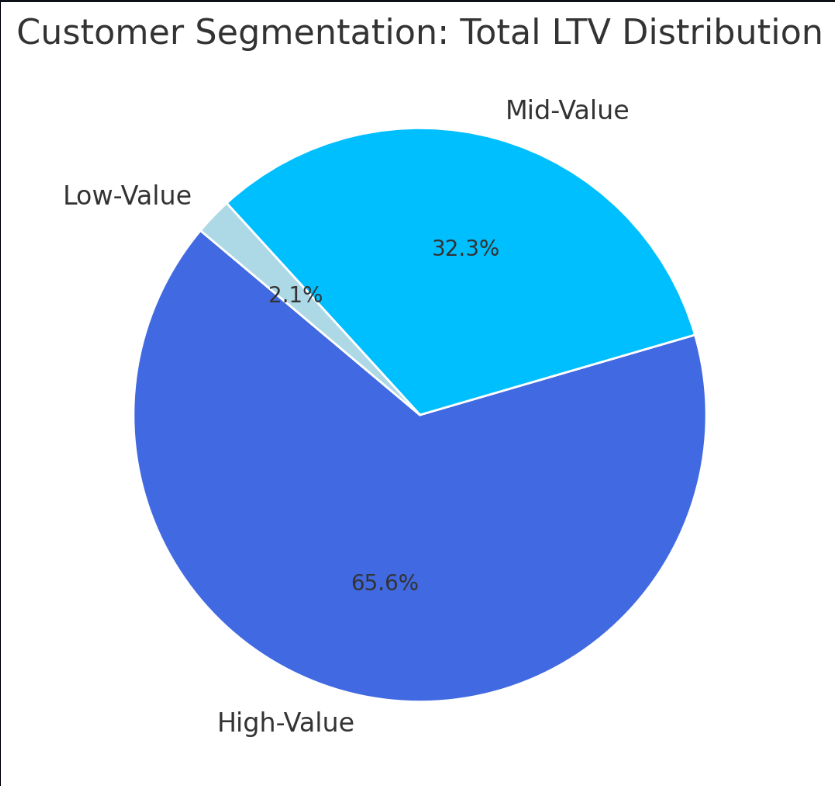
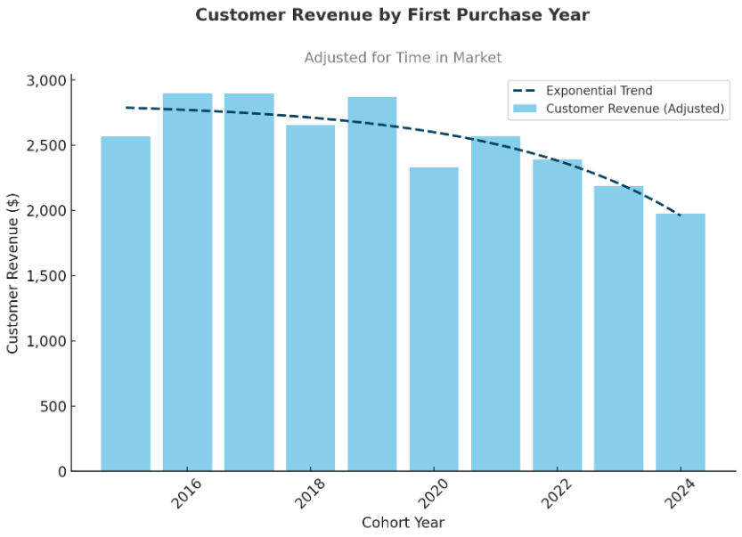
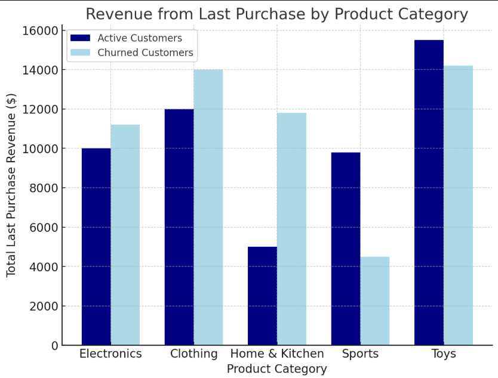

# 📊 Customer Behavior, Retention & Lifetime Value Analysis

## 📌 Overview

Analysis of **customer behavior, retention, and lifetime value (LTV)** for an e-commerce company to improve customer retention and maximize revenue.

---

## 🎯 Business Questions

1. **Customer Segmentation:** Who are our most valuable customers?
2. **Cohort Analysis:** How do different customer groups generate long-term revenue?
3. **Retention Analysis:** Which customers haven't purchased recently?

--- 

# 🔍 Analysis Approach

## 1. Customer Segmentation Analysis

* Categorized customers based on total lifetime value (LTV)
* Assigned customers to **High, Mid, and Low-value** segments
* Calculated key metrics including total revenue

🖥️ **SQL Query:** [2.1_customer_segementation.sql](1_customer_segmentation.sql)

### 📈 Visualization



📊 **Key Findings:**

* **High-value segment:** 25% of customers drive **66% of revenue ($135.4M)**
* **Mid-value segment:** 50% of customers generate **32% of revenue ($66.6M)**
* **Low-value segment:** 25% of customers account for **2% of revenue ($4.3M)**

### 💡 Business Insights

* **High-Value — 66% Revenue:** Offer a premium membership program to **12,372 VIP customers**, as losing one customer can significantly impact revenue.
* **Mid-Value — 32% Revenue:** Create upgrade paths through personalized promotions, with a potential **$66.6M → $135.4M** revenue opportunity.
* **Low-Value — 2% Revenue:** Design re-engagement campaigns and price-sensitive promotions to increase purchase frequency.

---

## 2. Cohort-Based Analysis

* Tracked cumulative revenue per customer cohort
* Analyzed lifetime value trends
* Evaluated acquisition channel performance

🖥️ **SQL Query:** [2_cohort_analysis.sql](2_cohort_analysis.sql)

### 📈 Visualization



📊 **Key Findings:**

* **2023 cohorts:** 25% higher LTV than 2022
* **Social media customers:** 2× higher 12-month LTV
* **Holiday cohorts:** 40% better retention

---

## 3. Retention Analysis

* Identified customers at risk of churning
* Analyzed last purchase patterns
* Calculated customer-specific metrics and warning indicators

🖥️ **SQL Query:** [3_retention_analysis.sql](3_retention_analyse.sql)

### 📈 Visualization



📊 **Key Findings:**

* **2023 cohort:** Highest first-year LTV at approximately **$1.2M average/month**
* **2022 cohort:** Plateaus at approximately **$1.1M average/month** after 12 months
* **2019–2021 cohorts:** Show a consistent growth pattern:

  * **First 3 months:** Rapid growth to ~$800K average/month
  * **Months 4–8:** Steady increase to ~$1M average/month
  * **Months 9–12:** Stabilization around ~$1.1M average/month

### 💡 Business Insights

* **Cohort Performance:** The 2023 cohort outperformed previous years by **9% in first-year value**, suggesting successful acquisition strategies worth further investigation.
* **Growth Patterns:** A critical engagement window was identified during **months 4–8**, requiring targeted campaigns during plateau periods.
* **Revenue Optimization:** Focus on the first 3 months for customer engagement, followed by retention strategies during the months 4–8 growth period.

---

# 🚀 Strategic Recommendations

### 1. High-Value Focus — $100K Opportunity

* Launch a premium membership program
* Deploy a churn early-warning system
* Implement proactive customer service outreach

### 2. Acquisition Optimization

* Increase social media investment based on the observed **2× LTV**
* Optimize seasonal acquisition timing
* Adjust CAC based on channel performance

### 3. Retention Enhancement

* Launch segment-specific reactivation campaigns
* Create automated upgrade paths
* Develop targeted loyalty programs

---

# 🛠️ Technical Details

| Category           | Technology |
| ------------------ | ---------- |
| **Database**       | PostgreSQL |
| **Analysis Tools** | PostgreSQL |
| **Visualization**  | ChatGPT    |

---

# 📂 Project Structure

```text
project/
│
├── README.md
│
├── 2.1_customer_segementation.sql
├── 2.2_cohort_ltv_over_time.sql
├── 3_retention_analysis.sql
│
└── images/
    ├── 2.1_customer_segementation.png
    ├── 2.2_cohort_ltv_over_time.png
    └── 4_example.png
```

---

# 📈 Key Business Takeaways

The analysis shows that customer value is highly concentrated across different customer segments.

The **High-Value segment contributes 66% of total revenue while representing only 25% of customers**, highlighting the importance of customer retention and VIP-focused strategies.

Cohort analysis also reveals differences in long-term customer value across acquisition periods and channels, while retention analysis helps identify customers who may require targeted re-engagement.

Combining **Customer Segmentation, Cohort Analysis, LTV Analysis, and Retention Analysis** provides a comprehensive framework for understanding customer behavior and identifying opportunities to improve long-term revenue.

---

## 👨‍💻 Skills Demonstrated

* SQL
* PostgreSQL
* Customer Segmentation
* Customer Lifetime Value (LTV)
* Cohort Analysis
* Retention Analysis
* Churn Analysis
* Revenue Analysis
* Data Aggregation
* Percentile Analysis
* Business Analysis
* Data-Driven Decision Making
